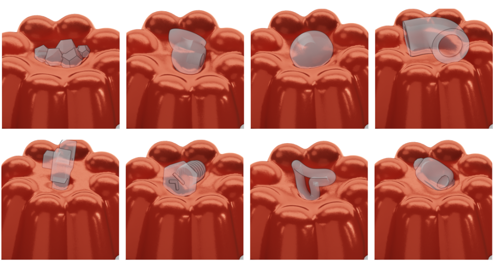
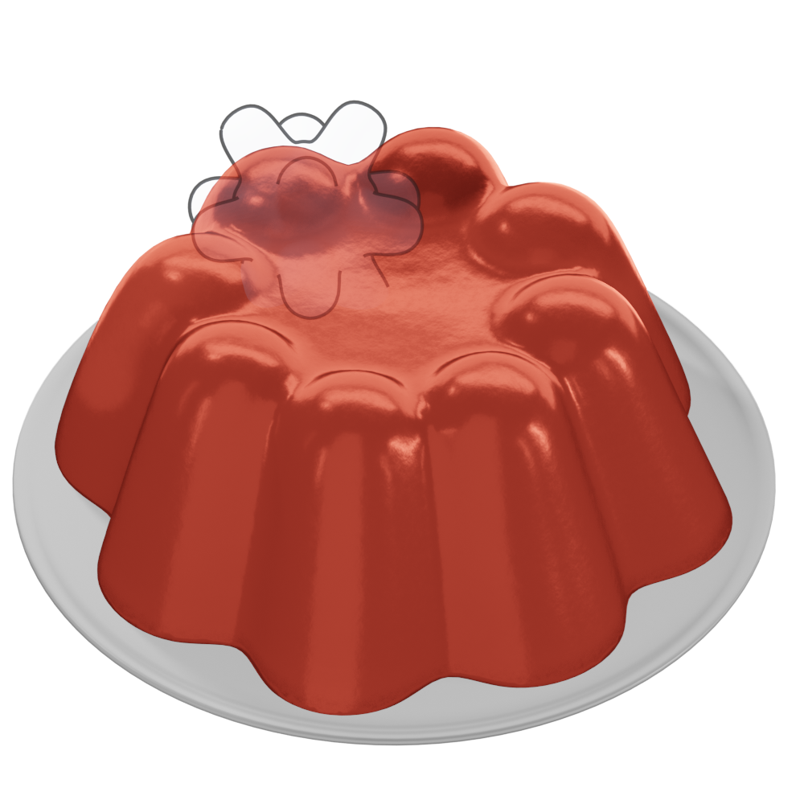
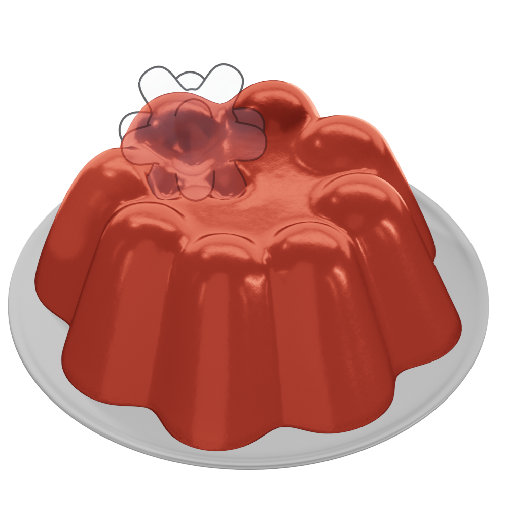
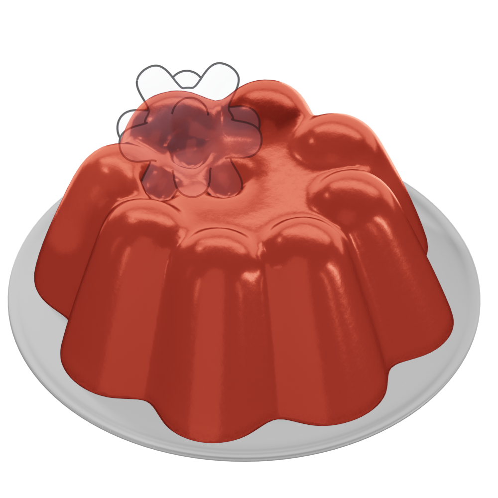
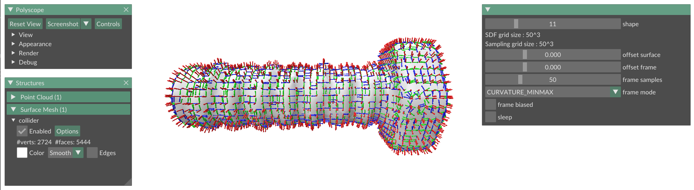
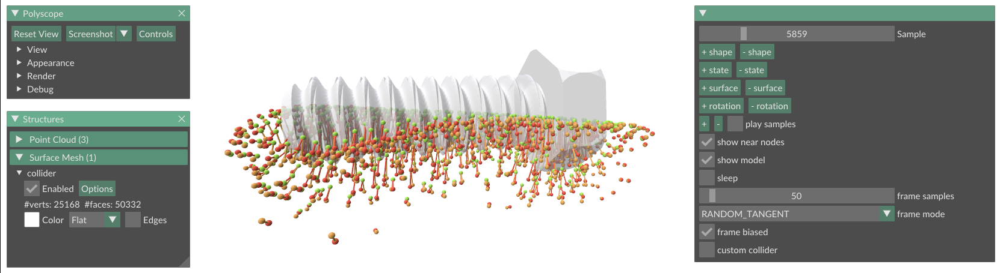

# Learning Contact Deformations with General Collider Descriptors

[Cristian Romero](http://crisrom002.gitlab.io/), [Dan Casas](https://dancasas.github.io/), [Maurizio Chiaramonte](https://scholar.google.com/citations?hl=es&user=6Y0LlQMAAAAJ) and [Miguel A. Otaduy](http://mslab.es/otaduy/)



This repository contains source code and data for the paper [Learning Contact Deformations with General Collider Descriptors](https://dl.acm.org/doi/10.1145/3610548.3618229), published at SIGGRAPH Asia 2023.

### Abstract

> This paper presents a learning-based method for the simulation of rich contact deformations on reduced deformation models. Previous works learn deformation models for specific pairs of objects; we lift this limitation by designing a neural model that supports general rigid collider shapes. We do this by formulating a novel collider descriptor that characterizes local geometry in a region of interest. The paper shows that the learning-based deformation model can be trained on a library of colliders, but it accurately supports unseen collider shapes at runtime. We showcase our method on interactive dynamic simulations with animation of rich deformation detail, manipulation and exploration of untrained objects, and augmentation of contact information suitable for high-fidelity haptics.

## Setup

To run the code, first make sure that the required software is installed. The project only requires ```Git``` and ```Python3```, and it should work on **Windows, Mac and Linux** systems without any issues.
For Ubuntu / Debian systems, run the following command:

```
sudo apt install git python3 python3-pip python3-venv
```

Now clone the repository and make it the current working directory:
```
git clone https://github.com/crisrom002/collider-descriptors-deformation-learning
cd collider-descriptors-deformation-learning
```
Generate a Python environment and make it active. This is optional, but highly recommended to keep the project and dependencies isolated from the system:
```
python3 -m venv environment
source environment/bin/activate
```
In the newly created environment, we need PyTorch for training the models. For a **CPU installation**, run the following pip command:
```
python -m pip install torch --index-url https://download.pytorch.org/whl/cpu
```
If you want to use GPU computation instead, you will need to install a different version. Check the [PyTorch instructions](https://pytorch.org/get-started/locally/) for details.

Finally, install the remaining Python dependencies:
```
python -m pip install -r requirements.txt
```
The default ```bpy``` dependency may require a specific Python version. In that case, you need to change to compatible bpy / Python versions to complete successfully.

At this point, the Python environment is ready to run all the training and visualization scripts. Now we need some data to work with.

## Datasets

Together with the repository, we provide the [datasets](https://urjc-my.sharepoint.com/:u:/g/personal/cristian_romero_urjc_es/EdfbqYpRTvpAgMbdcIklRm0BROzwkEQHobTnZlt3CjyXGw?e=nWu6jw) used for training and validation of the jelly examples in the paper.
Run the following script to download and unzip the ```data``` folder from the shared link to the working directory:

```
python download.py --output_path ./
```

The download, among other things, contains the contact deformation datasets of **two different contact problems**:  

* ```jelly3D_thingi3D```:  This dataset is used for training the jelly examples in the paper. It consists of contact interaction samples for different jelly configurations and colliders (52 shapes from the [Thingi10K dataset](https://ten-thousand-models.appspot.com/), shown in Fig.8 of the paper).  You can visualize the dataset interactively with the evaluation script:
  
  ```
  python evaluate.py visualize --contact_problem jelly3D_thingi3D
  ```
  
* ```jelly3D_sphereSpiky3D```:  This dataset is used for validation. It consists of a recorded contact interaction of the jelly and a spiky collider shape. This collider is not in the training set, allowing us to evaluate our model with unseen shapes. You can visualize the dataset interactively with the evaluation script:
  
  ```
  python evaluate.py visualize --contact_problem jelly3D_sphereSpiky3D
  ```
  
In the visualizations, the baseline $\textcolor{green}{\text{reduced deformations}}$ are shown in green, the simulated ground truth $\textcolor{orange}{\text{full deformations}}$ are shown in orange, and the resulting $\textcolor{red}{\text{ model deformations}}$ are shown in red. Using the GUI you can show or hide the different deformation meshes, and explore the different dataset samples. 

<video src="https://github.com/crisrom002/collider-descriptors-deformation-learning/assets/95915312/9508cf47-2ad8-4341-9721-6f4168f59f38"></video>

We are using [Polyscope](https://polyscope.run/py/) for all the interactive visualizations. If you need similar functionality for your projects, don't hesitate to take a look at this extraordinary library!

## Training

Using the ```jelly3D_thingi3D``` dataset, and providing a path with the desired log directory, run the following script to **train the contact deformation model**:

```
python train.py --contact_problem jelly3D_thingi3D \
                --log_path logs/log_jelly3D_thingi3D \
                --num_workers 4 \
                --learning_rate 1e-3 \
                --epochs 100 \
                --epochs_per_test 1 \
                --epochs_early_stop 10 \
                --tensorboard_log
```

As described in the paper, by default the first 30 collider shapes are used for training and the remaining 22 collider shapes are used for quantitative testing. The training will run for a maximum of 100 epochs, saving the best model so far based on the testing loss value. The best model file is saved in the log directory as ```model.pth```, and a checkpoint per epoch is saved in the ```/checkpoints``` subdirectory. To **optimize the training** performance, you may need to play with the ```--num_workers``` argument. Check the PyTorch [documentation](https://pytorch.org/docs/stable/data.html#single-and-multi-process-data-loading) for details.

The training script prints basic information of the training process and loss values during training. However, we can get more details of the process using the generated log information.

### Visual log

To preview and **compare the model checkpoints** at any training stage, the evaluation script can be used, providing the extra ```--log_path``` argument with the training log path.

```
python evaluate.py visualize --contact_problem jelly3D_thingi3D \
                             --log_path logs/log_jelly3D_thingi3D
```

Using the GUI, the deformation results of different model checkpoints can be evaluated and compared. To show model evaluation results, activate the ```show model``` checkbox. To change the evaluated checkpoint, play with the ```model checkpoint``` slider.

<video src="https://github.com/crisrom002/collider-descriptors-deformation-learning/assets/95915312/41c7f45f-41ea-40bf-afba-daaceb29e4e0"></video>
  
### Numeric log

In addition, we can use Tensorboard to supervise the training in a more quantitative way. If the ```--tensorboard_log``` flag is provided for training, a log is generated with the different train and test losses. You can easily run the log in tensorboard, inside the active Python environment:

```
tensorboard --logdir logs/log_jelly3D_thingi3D
```

Then, to visualize the log, just connect locally to [http://localhost:6006/](http://localhost:6006/) in your preferred web browser.

## Model Evaluation

After training the model, we can validate its results with the ```jelly3D_sphereSpiky3D``` dataset. This evaluation will reproduce some experiments of the paper. To facilitate the generation of results without training, we also provide a complete **pre-trained model** located in **data/models/jelly3D_thingi3D.pth**. We use this model in the following explanations, but you can train and use your own model, of course. 

### Visualization

Use the visualization script to explore the trained model, specifying the validation dataset and the model path using the  ```--model_file``` argument:

```
python evaluate.py visualize --contact_problem jelly3D_sphereSpiky3D \
                             --model_file data/models/jelly3D_thingi3D.pth
```

The resulting jelly deformations can be compared with the ground truth deformations, for any sample of the interaction. Optionally, the **descriptor values can be precomputed** with the flag ```--precompute_descriptor```, accelerating the runtime model evaluation as described in the paper (Sec 4.1).

<video src="https://github.com/crisrom002/collider-descriptors-deformation-learning/assets/95915312/897d0173-680c-4514-b0b3-8ad07186a384"></video>
  
### Recording

The different visualized meshes can also be saved for later use, changing the script to **recording mode**:

```
python evaluate.py record --contact_problem jelly3D_sphereSpiky3D \
                          --model_file data/models/jelly3D_thingi3D.pth \
                          --output_path recordings
```

This recording will store the sequence of deformation meshes produced by the model (**model.pc2**), together with the reduced baseline (**reduced.pc2**) and the full ground truth (**full.pc2**). The collider mesh is also stored (**collider.pc2**) to facilitate the rendering of a complete interaction.

### Rendering

The recorded results can be rendered, reproducing the results in the paper. For example, to get a **still frame** of the model, run the rendering script as follows:

```
python render.py --scene_file data/blends/jelly3D_sphereSpiky3D.blend \
                 --object_file recordings/model.pc2 \
                 --collider_file recordings/collider.pc2 \
                 --render_still 500 \
                 --num_samples 64 \
                 --output_file renders/model.png
```

This will generate our results of the jelly as shown in Fig.9 of the paper, in this case for the sample 500 in the dataset. The **comparison to the full and reduced deformations** can be easily rendered, replacing the  ```--object_file``` argument with any of the previously recorded sequence files:

<table>
  <tr>
     <td>reduced.png</td>
     <td>model.png</td>
     <td>full.png</td>
  </tr>
  <tr>
    <td></td>
    <td></td>
    <td></td>
  </tr>
 </table>

The same script can also be used to render an **animated video** of the validation dataset:

```
python render.py --scene_file data/blends/jelly3D_sphereSpiky3D.blend \
                 --object_file recordings/model.pc2 \
                 --collider_file recordings/collider.pc2 \
                 --render_animation 0 835 60 \
                 --num_samples 16 \
                 --output_file renders/model.mp4
```

This will render a clip from sample 0 to 835, playing at 60 frames per second. For a **fast preview**, the number of render samples can be reduced with the ```--num_samples``` argument.
Same as with still images, we can generate the video corresponding to each of the different sequence files.

<table>
  <tr>
    <td><video src="https://github.com/crisrom002/collider-descriptors-deformation-learning/assets/95915312/73198521-bde5-42dc-a27b-80add6d67a4a" width=320></td>
    <td><video src="https://github.com/crisrom002/collider-descriptors-deformation-learning/assets/95915312/93967cff-c507-4302-a5ca-46c81a6eb034" width=320></td>
    <td><video src="https://github.com/crisrom002/collider-descriptors-deformation-learning/assets/95915312/44478367-44b4-4c9f-9acf-ca8f32305381" width=320></td>
  </tr>
</table>

We are using a headless Python module of [Blender](https://www.blender.org/) for all the renders in the paper. A really amazing software!

## Debugging Tools

### Descriptor frames

We offer a specific script for debugging our descriptor frames, providing the path to the desired collider data:

```
python debug.py --collider_path data/colliders/thingi3D
```

This is useful to ensure the correct computation of the frames, and to visualize the different **frame generation modes** discussed in the paper (Sec 3.2).



### Near nodes

To accelerate the training we only evaluate the loss in those nodes near to the collider, as explained in the paper (Sec 3.4). For a given dataset, these nodes can be precomputed / visualized adding the ```--show_near_nodes``` flag to any visualization script:

```
python evaluate.py visualize --contact_problem jelly3D_thingi3D \
                             --model_file data/models/jelly3D_thingi3D.pth \
                             --show_near_nodes
```

After precomputing, you will have a new checkbox in the GUI to **show near nodes** instead of surfaces. For debugging, we also draw vector lines connecting the reduced node positions with the corresponding deformed node positions after contact.



## Citation

If you use our work, please cite our paper:

```
@inproceedings{romero2023contactdescriptorlearning,
    author  = {Romero, Cristian and Casas, Dan and Chiaramonte, Maurizio M. and Otaduy, Miguel A.},
    title   = {Learning Contact Deformations with General Collider Descriptors},
    articleno = {77},
    booktitle = {SIGGRAPH Asia 2023 Conference Papers},
    publisher = {Association for Computing Machinery},
    year    = {2023}
}
```
